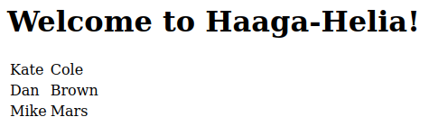
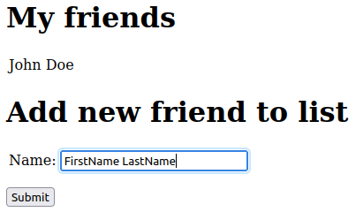
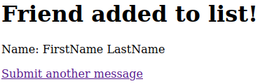
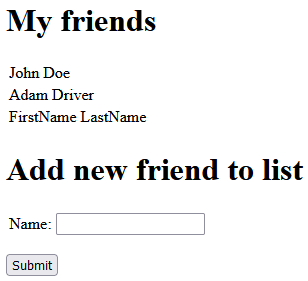

# 2. Model & View

- [2. Model & View](#2-model--view)
  - [1. Hello Thymeleaf](#1-hello-thymeleaf)
  - [2. Handling Lists](#2-handling-lists)
  - [3. Friend List](#3-friend-list)
  - [4. Bookstore](#4-bookstore)

Run the java application file [PalvelinohjelmointiApplication.java](src/main/java/com/example/Palvelinohjelmointi/PalvelinohjelmointiApplication.java) and open browser at `localhost:8080`

## 1. Hello Thymeleaf

- [HelloController.java](src/main/java/com/example/Palvelinohjelmointi/web/HelloController.java)
- [hello.html](src/main/resources/templates/hello.html)

`/hello?name=${name}&age=${age}`

If age is >= 18: *Welcome ${name}!*

If age is < 18: *You are too young!*

## 2. Handling Lists

- [Student.java](src/main/java/com/example/Palvelinohjelmointi/domain/Student.java)
- [StudentController.java](src/main/java/com/example/Palvelinohjelmointi/web/StudentController.java)
- [studentlist.html](src/main/resources/templates/studentlist.html)

`/studentlist`

<kbd>
  
</kbd>

## 3. Friend List

- [Friend.java](src/main/java/com/example/Palvelinohjelmointi/domain/Friend.java)
- [FriendController](src/main/java/com/example/Palvelinohjelmointi/web/FriendController.java)
- [index.html](src/main/resources/templates/index.html)
- [result.html](src/main/resources/templates/result.html)

`/index`

<kbd>
  
</kbd>

Submitting redirects to confirmation page `result.html`

Returning to `/index` shows new name(s) added to list

<kbd>
  
</kbd>

## 4. Bookstore

Link to repository: https://github.com/JoonasKulmala/Bookstore/tree/master

This project will be updated throughout the course

As per instructions these features have been implemented:

- Create controller to handle GET request to path `index`
- Create class Book with attributes *title, author, year, isbn, price*
