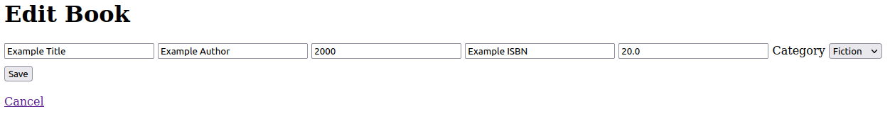

# 3. Database & JPA (2/2)

- [3. Database & JPA (2/2)](#3-database--jpa-22)
  - [1. Bookstore: One-to-many](#1-bookstore-one-to-many)
    - [a) Entity: Category](#a-entity-category)
    - [b) One-to-many between Book & Category](#b-one-to-many-between-book--category)
    - [c) Category - CRUD repository](#c-category---crud-repository)
    - [d) Category dropdown in Book Create](#d-category-dropdown-in-book-create)
    - [e) Category in Book Read, Update](#e-category-in-book-read-update)
    - [f) Category - CommandLineRunner](#f-category---commandlinerunner)
  - [2. JBDC: Customerlist (Optional](#2-jbdc-customerlist-optional)
    - [a)](#a)
    - [b)](#b)
    - [c)](#c)
    - [d)](#d)
    - [e)](#e)

## 1. Bookstore: One-to-many

### a) Entity: Category

Create new java class [Category.java]() with attributes *id* and *name*

### b) One-to-many between Book & Category

Add One-to-many relationship between Book and Category

[Book.java]() has new attribute added

`Book.java`
```java
@Id
@GeneratedValue(strategy = GenerationType.AUTO)
private Long bookid;
private String title;
private String author;
private int year;
private String isbn;
private double price;
@ManyToOne
@JoinColumn(name = "categoryid")
private Category category;
```

Similarly [Category.java]() class' attributes

`Category.java`
```java
@Id
@GeneratedValue(strategy = GenerationType.AUTO)
private Long categoryid;
private String name;
@OneToMany(cascade = CascadeType.ALL, mappedBy = "category")
private List<Book> books;
```

### c) Category - CRUD repository

Create CRUD repository class [CategoryRepository.java] for `Category` class

### d) Category dropdown in Book Create

Edit [BookController.java] to add private repository for Category, retrieve in `/add`

`BookController.java`

```java
@Controller
public class BookController {
	@Autowired
	private BookRepository repository;
	@Autowired
	private CategoryRepository repository2;
  ...

    @RequestMapping(value = "/edit/{id}")
    public String editBook(@PathVariable("id") Long bookId, Model  model) {
	    model.addAttribute("book", repository.findById(bookId));
	    model.addAttribute("categories", repository2.findAll());
	    return "editbook";
  }
```
Edit [addbook.html]() to add dropdown menu for Category

`addbook.html`
```html
<form th:object="${book}" th:action="@{save}" action="#" method="post">
	<label for="title">Title</label>
	<input type="text" id="title" th:field="*{title}" />
	<label for="author">Author</label>
	<input type="text" id="author" th:field="*{author}" />
	<label for="year">Year</label>
	<input type="text" id="year" th:field="*{year}" />
	<label for="isbn">Isbn</label>
	<input type="text" id="isbn" th:field="*{isbn}" />
	<label for="price">Price</label>
	<input type="text" id="price" th:field="*{price}" /><br>

	<label for="categorylist">Category</label>
    <select id="categorylist" style="width: 100px" th:field="*{category}" class="form-control">
		<option th:each="category: ${categories}" th:value="${category.categoryid}"
			th:text="${category.name}">
		</option>
	</select>
	<br>
	<input type="submit" value="Save" class="btn btn-success"></input>
</form>
```

Now `/add` form has Category dropdown

<kbd>
  
</kbd>

### e) Category in Book Read, Update

Same steps as above, add views in `/booklist` and `/edit`

- [BookController.java]()
- [booklist.html]()
- [edit.html]()

### f) Category - CommandLineRunner

Add some mockup data with CommandLineRunner in [BookstoreApplication.java]()

```java
// Hard coded Category data
repository2.save(new Category("Science"));
repository2.save(new Category("Fiction"));
repository2.save(new Category("History"));

// Hard coded Book data
repository.save(new Book("Example Title", "Example Author", 2000, "Example ISBN", 20, repository2.findByName("Science").get(0)));
repository.save(new Book("Spring Database & JPA", "Haaga-Helia", 2021,"isbn123", 0.0, repository2.findByName("Fiction").get(0)));
```

## 2. JBDC: Customerlist (Optional

### a)

### b)

### c)

### d)

### e)
