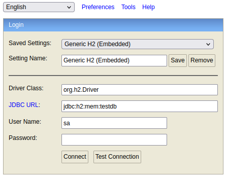
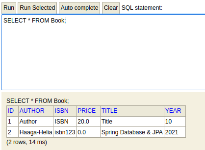
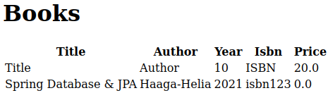
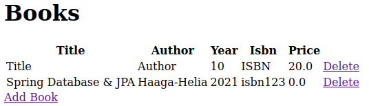
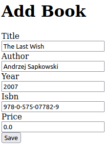
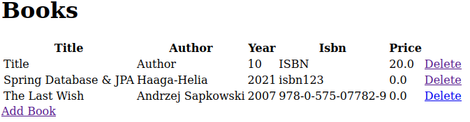
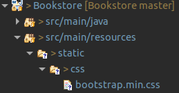
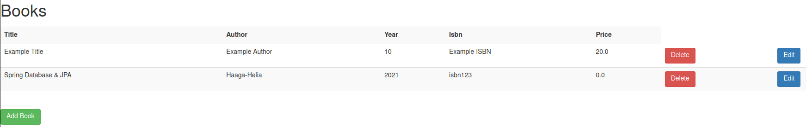
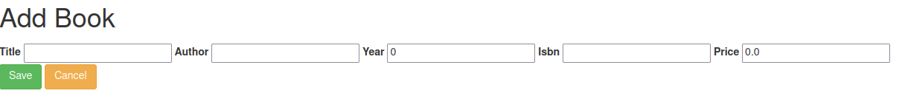

# 3. Database & JPA

- [3. Database & JPA](#3-database--jpa)
  - [1. Bookstore: Add JPA and database](#1-bookstore-add-jpa-and-database)
    - [a) JPA, H2 support](#a-jpa-h2-support)
    - [b) Entity from Book class](#b-entity-from-book-class)
    - [c) CommandLineRunner](#c-commandlinerunner)
    - [d) SQL statements in console](#d-sql-statements-in-console)
    - [e) Enable H2 console](#e-enable-h2-console)
  - [2. Bookstore: Listpage](#2-bookstore-listpage)
  - [3. Bookstore: CRUD](#3-bookstore-crud)
    - [Create](#create)
    - [Delete](#delete)
  - [4. Edit Bookstore](#4-edit-bookstore)
  - [5. Bookstore: A little bit Front-end (Extra)](#5-bookstore-a-little-bit-front-end-extra)

## 1. Bookstore: Add JPA and database

**NOTE!** Imports are not listed to avoid clutter.

### a) JPA, H2 support

Edit [pom.xml](pom.xml) and add the following dependencies

```xml
    <dependency>
      <groupId>org.springframework.boot</groupId>
      <artifactId>spring-boot-starter-data-jpa</artifactId>
    </dependency>

    <dependency>
      <groupId>com.h2database</groupId>
      <artifactId>h2</artifactId>
    </dependency>
```

### b) Entity from Book class

Edit [Book.java](src/main/java/fi/kulmala/Bookstore/domain/Book.java) to create an entity, automate ID creation

```java
    @Entity
    public class Book {
        
    	@Id
    	@GeneratedValue(strategy = GenerationType.AUTO)
    	private Long id;
        ...
```

### c) CommandLineRunner

Edit [BookstoreApplication.java](src/main/java/fi/kulmala/Bookstore/BookstoreApplication.java) to add CommandLineRunner, on application startup create 2 Book test objects

```java
@Bean
public CommandLineRunner productionDemo(BookRepository repository) {
	return (args) -> {
			
		repository.deleteAll();
			
		// Title, Author, Year, ISBN, Price
		repository.save(new Book("Title", "Author", 10, "ISBN", 20));
        repository.save(new Book("Spring Database & JPA", "Haaga-Helia", 2021, "isbn123", 0));
			
	};
}
```

### d) SQL statements in console

Edit [application.properties](src/main/resources/application.properties) and add

    spring.jpa.show-sql=true

### e) Enable H2 console

Edit [application.properties](src/main/resources/application.properties) to enable H2 console

    spring.h2.console.enabled=true
    spring.h2.console.path=/h2-console
    spring.datasource.url=jdbc:h2:mem:testdb

Run the Spring application and navigate to `localhost:8080/h2-console`

<kbd>
  
</kbd>

- on **JDBC URL** insert *jdbc:h2:mem:testdb* and hit connect

Run SQL command to retrieve data

```sql
    SELECT * FROM Book;
```

<kbd>
  
</kbd>

## 2. Bookstore: Listpage

Edit [BookController.java](src/main/java/fi/kulmala/Bookstore/web/BookController.java) to add GET method

```java
    @RequestMapping("/booklist")
	public String booklist(Model model) {
		model.addAttribute("books", repository.findAll());
		return "booklist";
	}
```

Create template [booklist.html](src/main/resources/templates/booklist.html)

<kbd>
  
</kbd>

## 3. Bookstore: CRUD

<kbd>
  
</kbd>

### Create

Edit [BookController.java](src/main/java/fi/kulmala/Bookstore/web/BookController.java) to add mapping to CREATE method

```java
    @RequestMapping("/add")
	public String addBook(Model model) {
		model.addAttribute("book", new Book());
		return "addbook";
	}
	
	@RequestMapping(value = "/save", method = RequestMethod.POST)
	public String save(Book book) {
		repository.save(book);
		return "redirect:booklist";
	}
```

Create template [addbook.html](src/main/resources/templates/addbook.html) with form

```html
    <h1>Add Book</h1>
        
        	<div>
        		<form th:object="${book}" th:action="@{save}" action="#" method="post">
        			<label for="title">Title</label><br>
      				<input type="text" id="title" th:field="*{title}" /><br>
      				<label for="author">Author</label><br>
      				<input type="text" id="author" th:field="*{author}" /><br>
      				<label for="year">Year</label><br>
      				<input type="text" id="year" th:field="*{year}" /><br>
      				<label for="isbn">Isbn</label><br>
      				<input type="text" id="isbn" th:field="*{isbn}" /><br>
      				<label for="price">Price</label><br>
      				<input type="text" id="price" th:field="*{price}" /><br>
      				
      				<input type="submit" value="Save"></input>
        		</form>
        	</div>
```

<kbd>
  
</kbd>

<kbd>
  
</kbd>

### Delete

Edit [BookController.java](src/main/java/fi/kulmala/Bookstore/web/BookController.java) to add mapping to DELETE method

```java
@RequestMapping(value = "/delete/{id}", method = RequestMethod.GET)
public String deleteBook(@PathVariable("id") Long bookId, Model model) {
    repository.deleteById(bookId);
	return "redirect:../booklist";
}
```

Add button link in [booklist.html](src/main/resources/templates/booklist.html) to DELETE method

```html
<tr th:each="book : ${books}">
    <td th:text="${book.title}"></td>
    <td th:text="${book.author}"></td>
    <td th:text="${book.year}"></td>
    <td th:text="${book.isbn}"></td>
    <td th:text="${book.price}"></td>
    <td><a th:href="@{/delete/{id}(id=${book.id})}">Delete</a></td>
</tr>
```

## 4. Edit Bookstore

Edit [BookController.java](src/main/java/fi/kulmala/Bookstore/web/BookController.java) to add mapping to UPDATE method

```java
@RequestMapping(value = "/edit/{id}")
public String editBook(@PathVariable("id") Long bookId, Model model) {
		model.addAttribute("book", repository.findById(bookId));
		return "editbook";
}
```

Create form [editbook.html](src/main/resources/templates/editbook.html), pass object attributes by ID

```html
<form th:object="${book}" th:action="@{../save}" action="#" method="post">
    <input type="hidden" th:field="*{id}" class="form-control" />
    <input type="text" th:field="*{title}" />
    <input type="text" th:field="*{author}" />
    <input type="text" th:field="*{year}" />
    <input type="text" th:field="*{isbn}" />
    <input type="text" th:field="*{price}" />
    <input type="submit" class="btn btn-success" value="Save"></input>
</form>
```

## 5. Bookstore: A little bit Front-end (Extra)

Download Bootstrap from: [Download](https://getbootstrap.com/docs/3.3/getting-started/)

File needed is `bootstrap-3.3.7/dist/css/bootstrap.min.css`

Copy to Bookstore project file location `src/main/resources/static/css/bootstrap.min.css`



Link it in `.html` file(s)

```html
<link type="text/css" rel="stylesheet" href="css/bootstrap.min.css" th:href="@{css/bootstrap.min.css}" />
```

<kbd>
    
</kbd>

<kbd>
    
</kbd>