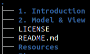
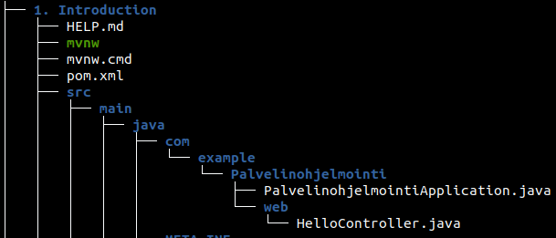

# Palvelinohjelmointi SWD4TN020-3013 | Joonas Kulmala

- [Palvelinohjelmointi SWD4TN020-3013 | Joonas Kulmala](#palvelinohjelmointi-swd4tn020-3013--joonas-kulmala)
  - [Course description](#course-description)
  - [License](#license)

## Course description

This course is about Java & Spring Framework. Exercises returned are located within subdirectories.

Actual java files are located here:

## License

All work is submitted under [MIT License](LICENSE).